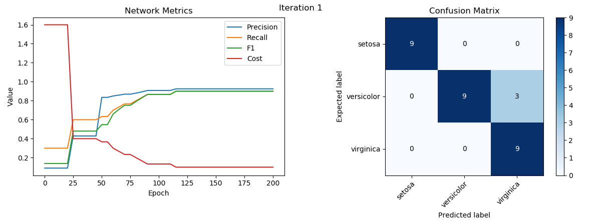
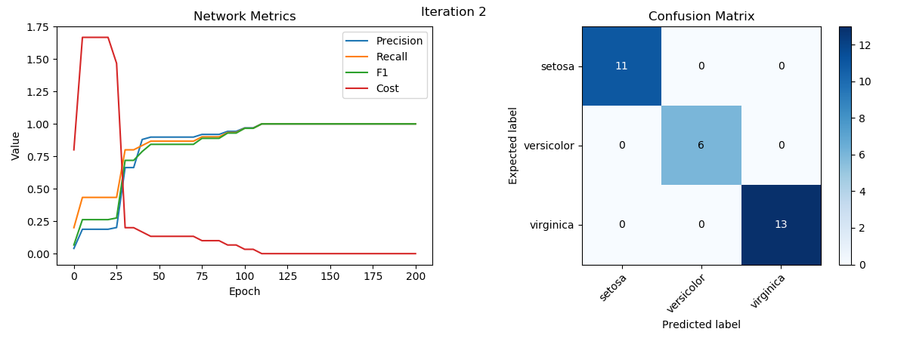
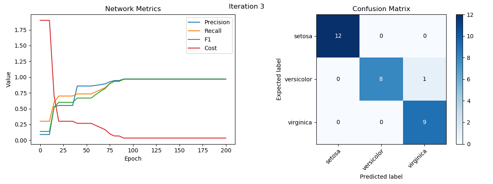
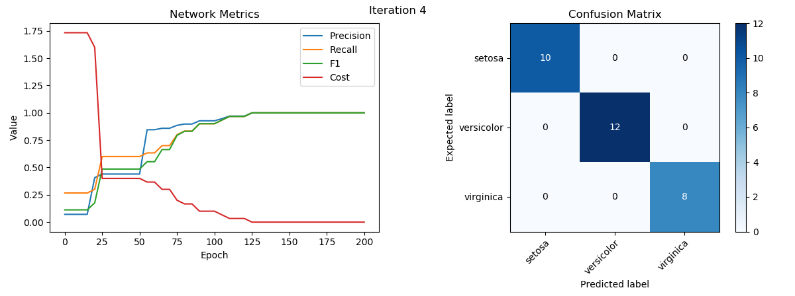
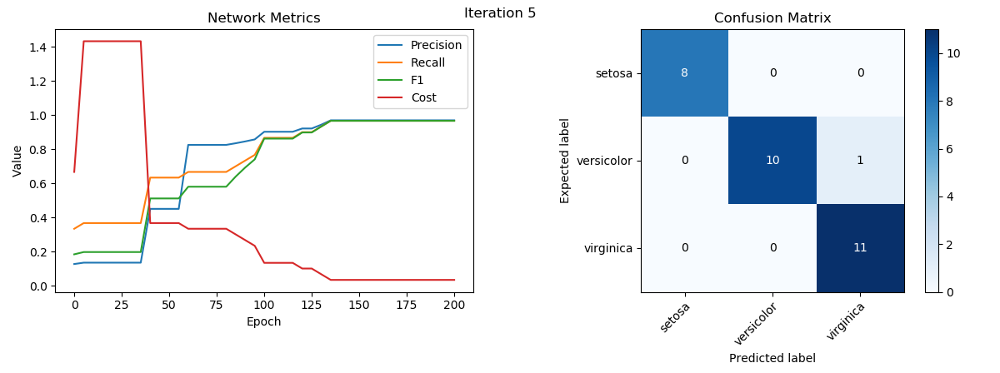

# Tarea 1
## Tabla de contenidos

- [Requisitos](#requisitos)
- [Instrucciones](#instrucciones)
- [Apreciaciones](#apreciaciones)
- [Resultados](#resultados)
  - [Iteración 1](#iteraci%c3%b3n-1)
  - [Iteración 2](#iteraci%c3%b3n-2)
  - [Iteración 3](#iteraci%c3%b3n-3)
  - [Iteración 4](#iteraci%c3%b3n-4)
  - [Iteración 5](#iteraci%c3%b3n-5)

## Requisitos
La tarea consiste en implementar una red neuronal desde 0, debe contener:

1. Neuronas
2. Red Neuronal
3. Funciones de activación
   1. Step
   2. Sigmoid
   3. Tanh
4. Función de error

Y debe hacer las siguientes cosas sobre el dataset a utilizar:

1. Normalización
2. Clasificación 1-hot encoding
   
También hay que generar un análisis a través de:
1. Matriz de confución
2. Graficar métricas

Como Bonus de debe lograr:
- Usar K-fold Cross-Validation para separar los datos de prueba de los de entrenamiento
- Usar múltiples datasets
- Variar parámetros dentro de la red y comparar como se comporta ésta
- Identificar neuronas que tienen pesos muy bajos y no aportan a la red

## Instrucciones

Para ejecutar la tarea se requiere `python 3.7.3` con las siguientes librerías.

    matplotlib==3.0.3
    numpy==1.17.1
    scikit-learn==0.21.3

Se debe ejecutar el siguiente comando ubicado en la carpeta Tarea1:
```console
python main.py
```

En el archivo main.py se encuentra el diccionario `properties` con todo lo relevante para correr la tarea

```Python
properties = {
    'hidden_layers': 2,
    'neurons_per_layer': 4,
    'input_length': 4,
    'number_of_classes': 3,
    'epoch': 200,
    'learning_rate': 0.1,
    'folds': 5,
    'sampling_rate': 5,
    'data': 'Data/Iris/data.npy',
    'dataset': 'Data/Iris/iris.data',
    'classes': 'Data/Iris/mapping.json'
}
```

<style type="text/css">
.tg  {border-collapse:collapse;border-spacing:0;}
.tg td{font-family:Arial, sans-serif;font-size:14px;padding:10px 5px;border-width:1px;overflow:hidden;word-break:normal}
.tg .tg-0lax{text-align:left;vertical-align:top}
</style>
<table class="tg">
  <tr>
    <td class="tg-0lax">'hidden_layers'</td>
    <td class="tg-0lax">Especifica el número de capas ocultas que va a tener la red neuronal</td>
  </tr>
  <tr>
    <td class="tg-0lax">'neurons_per_layer'</td>
    <td class="tg-0lax">Especifica el número de neuronas que habrá en cada capa oculta</td>
  </tr>
  <tr>
    <td class="tg-0lax">'input_length'</td>
    <td class="tg-0lax">La cantidad de valores que se entregaran como <span style="font-style:italic">input </span>a la red neuronal</td>
  </tr>
  <tr>
    <td class="tg-0lax">'number_of_classes'</td>
    <td class="tg-0lax">La cantidad de clases que tiene el <span style="font-style:italic">dataset </span>a utilizar</td>
  </tr>
  <tr>
    <td class="tg-0lax">'epoch'</td>
    <td class="tg-0lax">La cantidad de épocas a utilizar</td>
  </tr>
  <tr>
    <td class="tg-0lax">'learning_rate'</td>
    <td class="tg-0lax">El <span style="font-style:italic">learning rate</span> que se utilizará en la red neuronal</td>
  </tr>
  <tr>
    <td class="tg-0lax">'folds'</td>
    <td class="tg-0lax">La cantidad de <span style="font-style:italic">folds</span> que se utilizarán en el método K-folds</td>
  </tr>
  <tr>
    <td class="tg-0lax">'sampling_rate'</td>
    <td class="tg-0lax">Cada cuantas épocas se obtienen métricas</td>
  </tr>
  <tr>
    <td class="tg-0lax"><span style="font-weight:normal">'data'</span></td>
    <td class="tg-0lax">La dirección relativa desde el archivo main.py hacia donde se guardarán los datos a utilizar por la red neuronal</td>
  </tr>
  <tr>
    <td class="tg-0lax">'dataset'</td>
    <td class="tg-0lax">La dirección relativa desde el archivo main.py hacia donde se encuentra el archivo .data con los datos del dataset</td>
  </tr>
  <tr>
    <td class="tg-0lax">'classes'</td>
    <td class="tg-0lax">La dirección relativa desde el archivo main.py hacia donde se encuentra el archivo ,json con los nombres de las clases y su valor numérico</td>
  </tr>
</table>

## Apreciaciones

La principal dificultad para la realización de la tarea fue aplicar *backpropagation*, que si bien se aplica en pocas líneas de código, requiere entender plenamente lo que se está haciendo. Además se debe tener mucho cuidado al aplicarlo, ya que es difícil de *debugear*

Otra dificultad que hubo fue producto de la nula experiencia trabajando con *numpy*, a partir de ésto, se deben poder hacer bastantes optimizaciones.

Por problemas de tiempo no se implementó el *train* por *batches* de datos.


## Resultados

A continuación se procede a presentar los datos obtenidos al correr la tarea con las especificaciones que se muestran a continuación:

```Python
properties = {
    'hidden_layers': 2,
    'neurons_per_layer': 4,
    'input_length': 4,
    'number_of_classes': 3,
    'epoch': 200,
    'learning_rate': 0.1,
    'folds': 5,
    'sampling_rate': 5,
    'data': 'Data/Iris/data.npy',
    'dataset': 'Data/Iris/iris.data',
    'classes': 'Data/Iris/mapping.json'
}
```
Usando las particiones de datos generadas por *K-fold*, se corrieron 5 iteraciones distintas sobre el [dataset iris](https://archive.ics.uci.edu/ml/datasets/Iris), obteniéndose las siguientes métricas y matrices de confusión:

### Iteración 1


### Iteración 2


### Iteración 3


### Iteración 4


### Iteración 5


También al finalizar las 5 iteraciones se obtuvieron las siguientes métricas promediadas:

```
Precision: 0.9729
   Recall: 0.9667
       F1: 0.9666
     Cost: 0.03333
```
