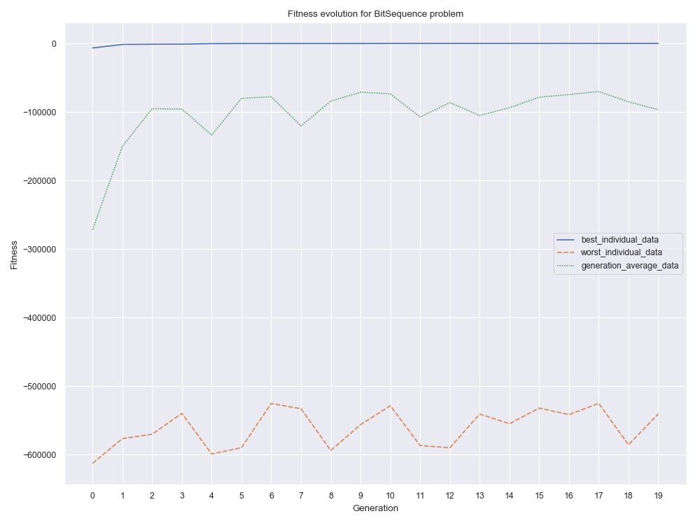
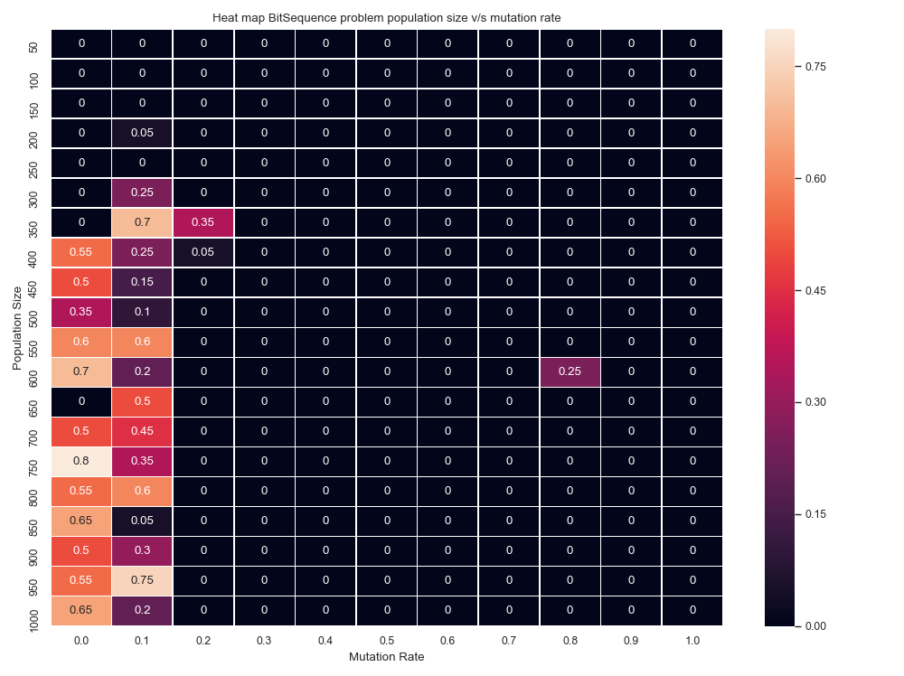

# Tarea 2
## Tabla de contenidos

- [Tarea 2](#tarea-2)
  - [Tabla de contenidos](#tabla-de-contenidos)
  - [Requisitos](#requisitos)
  - [Instrucciones](#instrucciones)
  - [Problema elegido](#problema-elegido)
    - [Individuo](#individuo)
    - [Función de *fitness*](#funci%c3%b3n-de-fitness)
    - [Consideraciones específicas del problema](#consideraciones-espec%c3%adficas-del-problema)
  - [Análisis](#an%c3%a1lisis)
    - [Evolución del *fitness*](#evoluci%c3%b3n-del-fitness)
    - [Heatmap población v/s ratio de mutación](#heatmap-poblaci%c3%b3n-vs-ratio-de-mutaci%c3%b3n)

## Requisitos
La tarea consiste en implementar un algorítmo genético y aplicarlo a en la resolución de los problemas **_FindWord_** **_BitSequence_** que consisten en encontrar una palabra dada y un número dado en binario respectivamente, también se debe aplicar en la resolución de uno de estos problemas:

- **Unbound-Knapsack**: Para una mochila que aguanta 15kg, encuentre la combinación de cajas que maximice el valor contenido en la mochila, pero que no se pase del peso máximo soportado. Las cajas permitidas son las siguientes:
  1. Caja de peso 12 y valor 4.
  2. Caja de peso 2 y valor 2.
  3. Caja de peso 1 y valor 2.
  4. Caja de peso 1 y valor 1.
  5. Caja de peso 4 y valor 10.

    Este problema se llama Unbound porque puede poner cuantas veces quiera cada caja, no hay límite (salvo por el límite de la mochila).
- **0-1-Knapsack**: Igual que el problema de Unbound-Knapsack, mismo peso máximo soportado por la mochila, y mismas cajas. La restricción es que solo tiene 1 caja de cada una, por lo que solo puede utilizar cada una a lo más 1 vez, no pueden haber repeticiones. No esta obligado a utilizarlas todas.
- **Laberinto**: Diseñe un laberinto aleatorio con obstáculos, una entrada y una salida. El objetivo es que el individuo parta en la entrada y deba llegar a la salida con el camino más corto.

El algoritmo debe tener las siguientes 3 etapas:
- **Evaluación**: Debe existir una forma donde se pueda evaluar a cada individuo de la población, y así, *rankearlos*. Esta evaluación viene dada por la función de *fitness* descrita más abajo.
  
- **Selección**: Debe existir una forma de seleccionar a los individuos de una población para elegir quiénes dejaran descendencia y quiénes no. Es importante considerar que debe existir diversidad dentro de nuestra población, ya que si no terminaremos con una población uniforme y podríamos caer en un mínimo/máximo local. Para la selección basta con que implemente alguno de los 2 algoritmos descritos en clases: la ruleta o el torneo.
  
- **Reproducción**: Una vez seleccionados los individuos, deben existir operaciones de manipulación genética, llamadas *crossover* y mutación. Estas deben estar implementadas dentro del algoritmo, donde como mínimo debe proveer una operación de *crossover*(como la partición en algún punto al azar de un individuo), y una operación de mutación (como reemplazar ungen aleatorio dentro de un individuo). Para la mutación necesitara la función de genes descrita más abajo.

Para que el algoritmo funcione se deben proveer 3 funciones(en algunos casos 2):
- **Función de *fitness***: Función que recibe 1 individuo y le asigna un valor, o conjunto de valores, numérico. Este valor se usa luego para la selección de quienes dejaran descendencia.
  
- **Función de generación de genes**: Función que retorna un gen dependiente del problema a resolver. Podría ser un número, un string, una tupla, una lista, u otro objeto dentro delo necesario de como se haya modelado el problema. Lo importante es que debe retornar ungen correspondiente a la decisión de diseño del planteamiento del problema.

- **Función de generación de individuos**: Función opcional que crea un conjunto de genes, lo que se traduce a un individuo. El número de genes a generar viene determinado por ustedes.

Los valores de entrada para construir al algoritmo debe contener por lo menos las siguientes variables:
- **Tamaño de la población**: Cuántos individuos se crearan inicialmente en el algoritmo. Este valor no implica que ustedes puedan aumentar o reducir la población después, eso depende de la implementación que quieran hacer.

- **Función de *fitness***: Explicado anteriormente, la función *defitness* debe ser ingresada como argumento al algoritmo ya que es dependiente del problema.

- **Función de generación de genes**: igual que el *fitness*, es altamente dependiente del problema por lo que debe ser explicitada como argumento al algoritmo.

- **Tasa de mutación**: Pueden interpretarlo como mejor crean, pero puede significar cuantos elementos de cada población variaran, o puede ser el porcentaje de genes de cualquier individuo que cambiara. Lo importante es que represente el porcentaje de mutación de un individuo o de un gen.

- **Condición de terminación**: Puede ser un número máximo de iteraciones, o alguna condición más compleja, pero debe existir una condición de terminación para que el algoritmo no continúe para siempre. No puede usar el “encontrar la solución” como condición de terminación porque no siempre sabrá cuál es la solución al problema.

Se pueden agregar más argumentos si se estima pertinente.

## Instrucciones
Para ejecutar la tarea se requiere `python 3.7.3` con las siguientes libreras.

    matplotlib==3.0.3
    numpy==1.17.1
    pandas==0.24.2
    seaborn==0.9.0

En el archivo redesNeuronales\Tarea2\main.py en la función main se puede elegir qué problema ejecutar descomentándolo y comentando el resto, también se encuentra un segmento de código que se utiliza para generar los gráficos que se muestran más adelante, está seteado para el problema de _**BitSequence**_, pero funcionan para todos los problemas, se tendría que cambiar el nombre del problema para los títulos de los gráficos.

Se debe ejecutar el siguiente comando estando ubicado en la carpeta Tarea2:
```console
python main.py
```
## Problema elegido
Para esta tarea se eligió resolver el problema **0-1-Knapsack** descrito en la sección [requisitos](#requisitos), se procede a explicar cómo se modeló el problema

### Individuo
Para éste problema se consideró como individuo una lista de 5 genes que pueden ser un "0" o un "1" y representan si la caja correspondiente a su índice está o no en la mochila, las cajas con sus índices son:

0. Caja de peso 12 y valor 4.
1. Caja de peso 2 y valor 2.
2. Caja de peso 1 y valor 2.
3. Caja de peso 1 y valor 1.
4. Caja de peso 4 y valor 10.

Por lo que el individuo pepe, definido a continuación, representa que se utiliza la **caja 1** (peso2 y valor 2) y la **caja 4** (peso 4 y valor 10)

        pepe = ["0","1","0","0","1"]

### Función de *fitness*
La función de fitness calcula el valor total asociado a la combinación de cajas del individuo

### Consideraciones específicas del problema
Se crea la función ***individual_viability_condition*** que toma como argumento un individuo y calcula el peso total asociado a la combinación de cajas del individuo, si este excede los 15kg, el individuo no es viable para el problema y se retorna *False*, en caso contrario se retorna *True*.

Se crea la función ***viable_individual_factory*** que crea individuos hasta generar uno viable, por medio de la función ***individual_viability_condition*** y lo retorna

se crea la función ***viable_mutation*** que reemplaza la función *mutation* en la clase *GeneticAlgorithm* la cual recibe un individuo y el índice del gen a mutar y revisa si la mutación genera un individuo viable, de ser así se retorna el nuevo gen, si no, se retorna el gen original

Se crea la función ***viable_crossover*** que reemplaza el *crossover* predefinido en la clase *GeneticAlgorithm* la cual recibe 2 individuos y hace lo siguiente, genera un individuo de la misma forma que el crossover original, pero si el nuevo individuo no es viable, se procede recorrer todos los genes del individuo y se prueba cambiarlo por uno de los de sus padres, y si el individuo se vuelve viable, se retorna, se probó ese método para todas las combinaciones posibles.

Con esas 4 funciones extras se crea un objeto de la clase *GeneticAlgorithm*, donde la variable *individual_viability_check* se deja como *True*, esto le dice al objeto que los individuos generados pueden no ser viables y hace que se utilicen las funciones antes creadas para asegurar la viabilidad de los individuos a lo largo de la simulación.

## Análisis
Considero que la implementación de *GeneticAlgorithm* es útil y deja todo listo para resolver cualquier tipo de problema por medio de extender la clase *Problem* se cubren tanto los casos donde todos los individuos sirven como los casos donde existen restricciones para éstos.

Se generaron 2 gráficos para el problema ***BitSequence*** con 20 iteraciones máximas y para encontrar el número **615781** (10010110010101100101) usando **20 genes**

### Evolución del *fitness*

Se puede apreciar que el mejor individuo parte siendo alto, esto xq se utiliza una población de 100 individuos, recordar que el fitness corresponde al negativo del valor absoluto de la diferencia entre 615781 y la representación decimal del individuo, por lo que mientras más cercano a 0, más parecido el número

### Heatmap  población v/s ratio de mutación

Se dejó fijo el máximo de iteraciones (20), el número a buscar (615781) y la cantidad de genes a utilizar (20) y se varió la población entre 50 y 1000 de 50 en 50 y también se varió el ratio de mutación de los genes de un individuo. Para este *heat map* se generó una métrica que consistía en el máximo de iteraciones menos las iteraciones realizadas y todo esto dividido en el máximo de iteraciones para normalizarlo. Por lo que mientras más alto sea el valor, quiere decir que la simulación terminó antes, cabe destacar que si la simulación terminó antes quiere decir que se encontró el número buscado.
